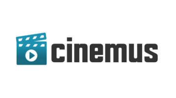
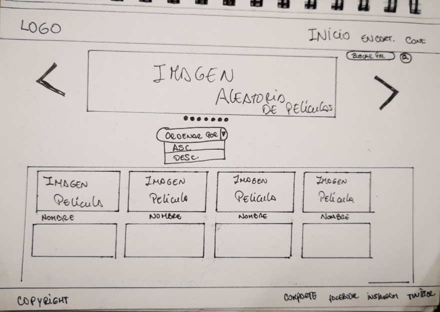
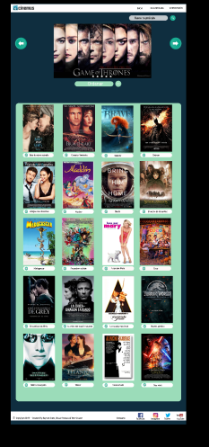
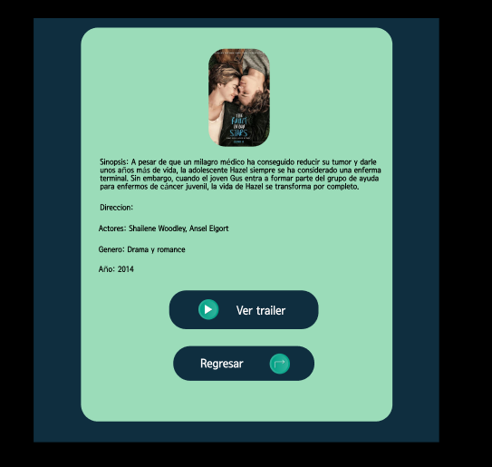
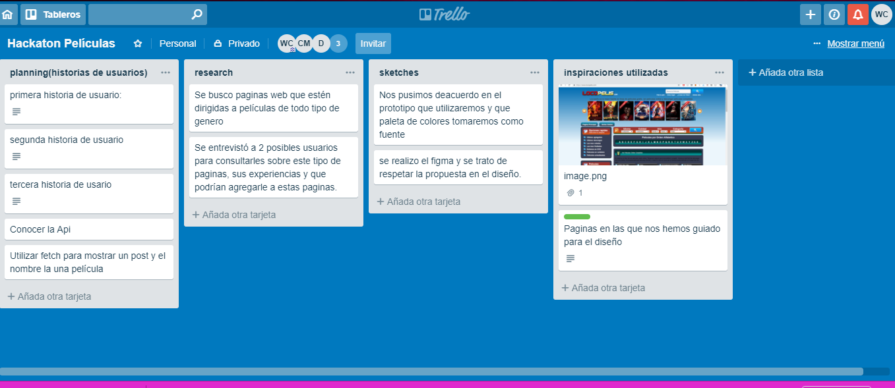

 
# CIMEMUS

## Índice

* [Introducción](#introducción)
* [Desccripción del Producto](#descripción-del-producto)
* [CINEMUS definición de usuario](#Cinemus-definición-de-usuario)
* [Proceso del diseño](#proceso-del-diseño)
* [Herramientas](#herramientas)
* [Autoras](#autoras)

 ***

## Introducción:
Te imaginas ir al cine sin tener información sobre una pelicula, sin saber que actores estan en el reparto, o sin haber leido antes una pequeña sinopsis. Para este problema hay una solución y es la nueva plataforma que te vamos a presentar a continuación.

CINEMUS es una página que ha sida creada para cinéfilos que les encanta todo tipo de películas y que tienen el interes de informarse sobre cada pelicula antes de verla. Te invitamos a echarle un vistazo y tener una experiencia diferente como ususario.

 

## Descripción del Producto:

CINEMUS ha sido creada para facilitarte información de todo tipo de peliculas. En esta página web encontraras muchas películas podras ver sinopsis, actores de reparto. Podras ordenar por orden alfabético en forma ascendente y descendente. Esperamos que sea de tu agrado y que disfrutes mucho al usarla.

## CINEMUS definición de usuario:

* Nuestros usuarios son personas que tengan la necesidad de conocer mas las películas e informarse sobre ellas, en esta página encontrarán datos especificos e importantes de cada película.

### Entrevistas

Realizamos entrevistas a dos posibles usuarios, les hicimos preguntas dirigidas al tema que fue películas, y sus respuestas nos ayudaron mucho a definir el camino que tomariamos en nuestra pagina web, tratamos de cubrir sus necesidades e inquietudes.
Les cmpartimos el Link donde encontraran las encuestas:

[entrevistas](https://docs.google.com/document/d/1HTQd3Hio7RmerJvs0jWUSinl-oHjZrD4l3SB2MykStw/edit)

### Frontend
***
|    Funcionalidad  |        DOM                   |     Diseño                     | 
| ------------------| ---------------------------- | -------------------------------| 
| -Conocer la Api   | -Realizamos una plantilla    |   -utilizar Boostrap para      |      
| -Consumir la Api  |   para un post y titulo      |     responsive                 | 
|   con fetch.      |    de una película.          | -Definir la paleta de colores  |
| -consolear un post| -Mostar la data  en el       | -Definir fuente de letra ycolor|    
|   y el titulo     |   documento de forma         | -Definir el estilo de los      |                                
|   de una pelicula |    dinámica                  |   contenedores                 |                                
| - hacer funcion   |                              | -Definir fondo de pantalla     |     
|  de ordenar de a-z|                              |                                | 
|   y de z-a        |                              |                                | 
### UX

## Consideraciones técnicas

### Historias de Usuarios

#### Historia N° 1
* Yo como ususario quisiera una plataforma donde me aparezca la opción de buscar la película o serie que quiero para tener información sobre ellas

#### Historia N° 2
* Yo como ususaria quisiera seleccionar el post de una película y tener la sinopsis,el reparto ,el año que fue publica, el genero, para tener conocimientos sobre la película y poder decidir si verla o no.

#### Historia N° 3
* Yo como ususaria quisiera ver los nombres de las películas en orden alfabetico ascendente y descendente, para poder seleccionar en forma mas clara cada pelicula.

## Proceso del diseño

### Research

Para hacer nuestro _RESEARCH_ estuvimos buscando información sobre páginas relacionadas al tema de esta hackaton, en nuestra busqueda nos encontramos con muchas páginas que enriquecierón nuestras ideas,y elegimos seis dentro de ellas por que cumplia su funcionalidad y eran faciles y entendibles para el usuario.

[QUBIT](https://global.qubit.tv/inicio/)
[CRACKLE](https://www.crackle.com.py/)
[MUBI](https://mubi.com/es)
[HULU](https://www.hulu.com/originals)
[CLASSIC](https://classiccinemaonline.com/)
[LOCOPELIS](https://www.locopelis.com/)

### Planning
Realizamos nuestro planning en un documento de google, compartimos el link.

[Planning](https://docs.google.com/document/d/1wTT4QKSDaqYs3eZpYqY473pAlqg50C5uaMqbGInZU18/edit)

### Sketches

#### Prototipo de baja calidad

### Prototipo de alta calidad
usamos figma para hacer nuestro prototipado de alta calidad

### Testeos de Usuabilidad

## Herramientas:

### Cuadro en Trello

compartimos el Link: [trello](https://trello.com/b/iVbUQQK7/hackaton-pel%C3%ADculas)

### Figma

En nuestro prototipo de alta fidelidad tratamos de representar en lo mas similar posible el diseño que elegimos.

Aqui compartimos el Link : 

[prototipo-figma](https://www.figma.com/proto/NqTg7Fntfz7iUPYvn51hcjFH/Hackathon---Pel%C3%ADculas?node-id=4%3A2&scaling=scale-down-width)

## Tips para la organización de trabajo entre UX y Front end 

* Las UX y FE entienden en conjunto el reto en el que van a trabajar, se organizan y arman sus primeros bocetos.
* Con los primeros bocetos/ideas, las FE pasan a crear su ambiente de desarrollo y a crear componentes atómicos que luego les sea fácil personalizar con CSS y utilizar para crear interfaces más complejas. Además, las FE empiezan también a trabajar en la lógica de la aplicación. Mientras tanto, las UX crean una guía de estilos, los flujos de usuarios, hacen un prototipo más completo y lo testean.
* Las UX comparten el prototipo testeado, para que el equipo empiece a personalizar los componentes y a ponerlos en conjunto.
* Las UX hacen QA y testing con los releases que vayan haciendo las FE.
* Planifiquen, historias de usuario y definition of done son importantísimos.
* Usen las ceremonias ágiles para saber en que van como equipo, dailys y retrospectivas diarias son esenciales.
* Iteren, iteren, iteren.

